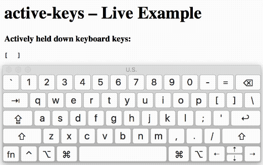

<!--
TODO: update repo description and URL, get pages turned on.
TODO: replace docs/ URLs with GH pages links
TOOD: build and coverage badges
-->

# active-keys

Know and listen for which keys the user is currently holding down using standard [KeyboardEvent#key](https://developer.mozilla.org/en-US/docs/Web/API/KeyboardEvent/key) values.

`npm install --save active-keys`

```js
import keyWatcher from 'active-keys';
keyWatcher.addEventListener('change', () => {
  console.log(Object.keys(keyWatcher.activeKeys));
});
```

- Even handles multiple of the same key held down (e.g. down right Alt, then down left Alt, and then up left Alt - will still indicate Alt down).
- Includes React helper.
- Requires support for [Set](https://developer.mozilla.org/en-US/docs/Web/JavaScript/Reference/Global_Objects/Set) and [KeyboardEvent#key](https://developer.mozilla.org/en-US/docs/Web/API/KeyboardEvent/key).
- Will err on the side of indicating that a key is inactive.

[Live Example](https://chrisjshull.github.io/active-keys/index.html)

[API Docs and Example Code](https://chrisjshull.github.io/active-keys/docs/index.html)


